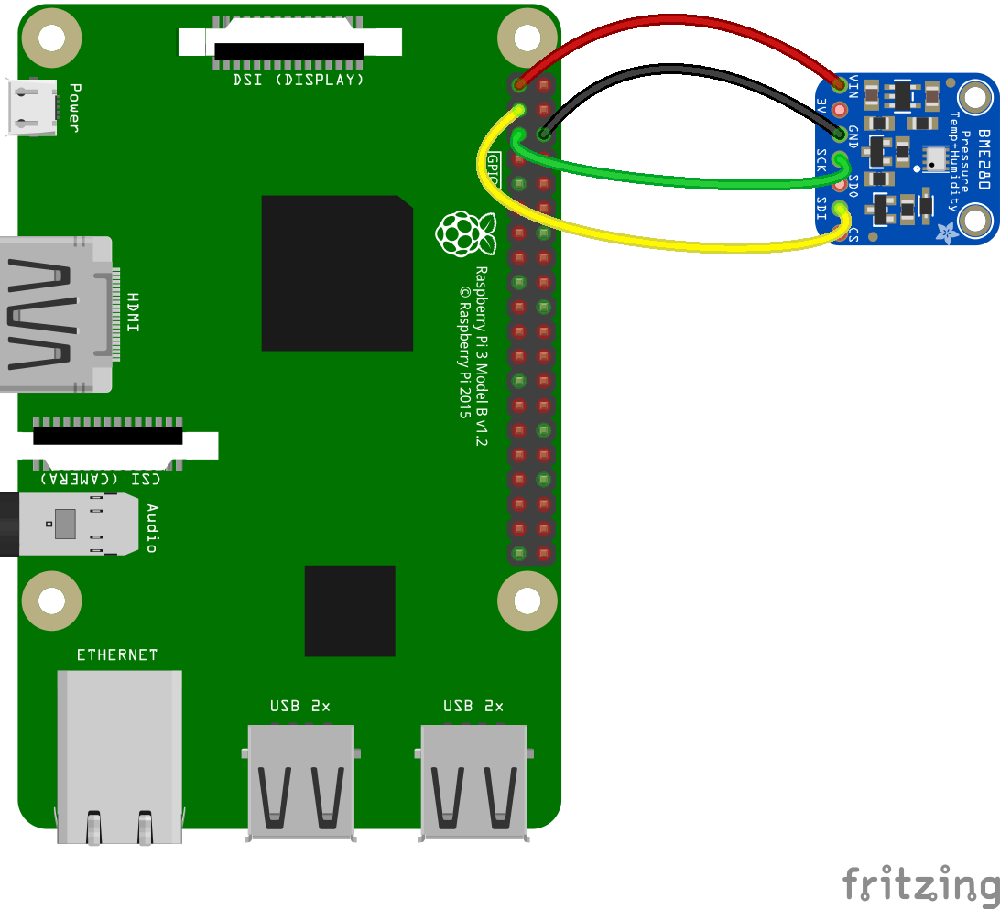

[](https://travis-ci.org/fivdi/bme280)
[](https://www.npmjs.com/package/bme280)
[](https://www.npmjs.com/package/bme280)

# bme280

BME280 humidity, pressure and temperature sensor I2C driver for Node.js on
Linux boards like the Raspberry Pi or BeagleBone.

Supports Node.js versions 6, 8, 10 and 12.

## Contents

 * [Features](#features)
 * [Installation](#installation)
 * [Usage](#usage)
   * [Circuit](#circuit)
   * [Report the Humidity, Pressure and Temperature](#report-the-humidity-pressure-and-temperature)
 * [API](#api)
 * [Related Packages](#related-packages)

## Features

 * Easy humidity, pressure and temperature sensing
 * Promise based asynchronous API

## Installation

```
npm install bme280
```

## Usage

#### Circuit



#### Report the Humidity, Pressure and Temperature
```js
const bme280 = require('bme280');

const delay = milliseconds =>
  new Promise(resolve => setTimeout(resolve, milliseconds));

bme280.open().then(sensor =>
  delay(40).
  then(_ => sensor.read()).
  then(reading => {
    console.log(reading);
    return sensor.close();
  })
).catch(console.log);
```

Sample output:
```js
{
  temperature: 22.80022401222959,
  pressure: 990.4595757059205,
  humidity: 51.50271664115457
}
```
## API

- [Functions](#functions)
- [Class Bme280](#class-bme280)
- [Enum OVERSAMPLE](#enum-oversample)
- [Enum FILTER](#enum-filter)

### Functions

- [open([options])](#openoptions)

#### open([options])
Returns a Promise that will be resolved with a Bme280 object on success, or will be rejected if an error occurs.

The following options are supported:
- i2cBusNumber - integer, I2C bus number, optional, default 1
- i2cAddress - integer, BME280 I2C address, optional, default 0x77
- humidityOversampling - One of the [OVERSAMPLE](#enum-oversample) enum values, controls oversampling of humidity data, optional, default OVERSAMPLE.X1
- pressureOversampling - One of the [OVERSAMPLE](#enum-oversample) enum values, controls oversampling of pressure data, optional, default OVERSAMPLE.X16
- temperatureOversampling - One of the [OVERSAMPLE](#enum-oversample) enum values, optional, controls oversampling of temperature data, default OVERSAMPLE.X2
- filterCoefficient - One of the [FILTER](#enum-filter) enum values, optional, slows down the response to the sensor inputs, default FILTER.F16

### Class Bme280

- [close()](#close)
- [read()](#read)

#### close()
Returns a Promise that will be resolved with no arguments once the underlying resources have been released, or will be rejected if an error occurs while closing.

#### read()
Returns a Promise that will be resolved with an object containing a sensor reading on success, or will be rejected if an error occurs.

An object containing a sensor reading has the following properties:
- humidity - number, relative humidity in percent
- pressure - number, pressure in hectopascal (1 hPa = 1 millibar)
- temperature - number, temperature in degrees Celsius

### Enum OVERSAMPLE

#### SKIPPED
Measurement skipped. The corresponding property in a sensor reading object will be undefined.
#### X1
Oversampling × 1
#### X2
Oversampling × 2
#### X4
Oversampling × 4
#### X8
Oversampling × 8
#### X16
Oversampling × 16

### Enum FILTER

Used to slow down the response to the sensor inputs.

#### OFF
Filter off
#### F2
Filter coefficient = 2
#### F4
Filter coefficient = 4
#### F8
Filter coefficient = 8
#### F16
Filter coefficient = 16

## Related Packages

- [i2c-bus](https://github.com/fivdi/i2c-bus) - I2C serial bus access

